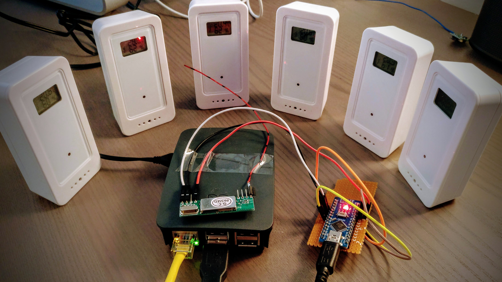
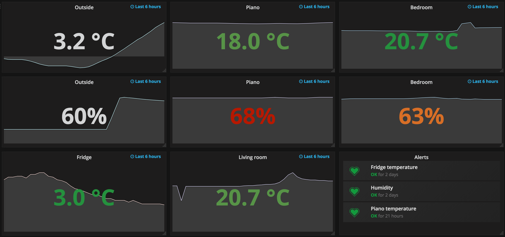
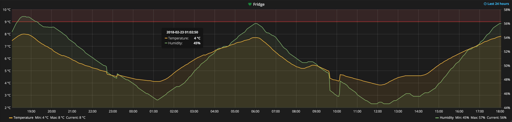
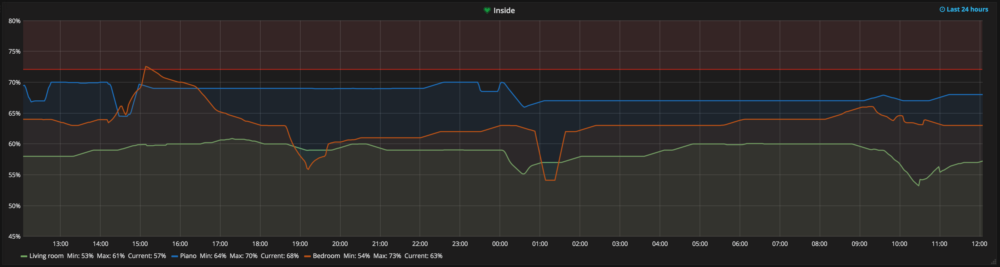

# Weather station

<p align="right">
  <a href="https://github.com/jckuester/weather-station/releases/latest">
    
  </a>
  <a href="https://github.com/jckuester/weather-station/master">
    
  </a>
  <a href="https://goreportcard.com/report/github.com/jckuester/weather-station">
    
  </a>
  <a href="https://codecov.io/gh/jckuester/weather-station">
    
  </a>
  <a href="https://godoc.org/github.com/jckuester/weather-station">
    
  </a>
  <a href="https://github.com/jckuester/weather-station/blob/master/LICENSE">
    
  </a>
</p>

<p>
  
  <em>Figure 1: Hardware in use: Raspberry Pi, Arduino Nano, RXB6 433Mhz receiver,
  and as many GT-WT-01 temperature/humidity sensors as you like.</em>
</p>

<p>
  
  <em>Figure 2: Grafana dashboard showing an overview of current
  temperatures and humidities around the house as well as the status of alerts
  (e.g., I want to get notified whether my piano is too cold or humid, so I can assure it stays longer tuned).</em>
</p>

<p>
  
  <em>Figure 3: Temperature and humidity of the fridge within the last 24h (the upper red line defines a threshold of 
  9° Celsius; so if the fridge gets too warm I get notified in Slack).</em>
</p>

<p>
  
  <em>Figure 4: Humidity inside rooms and piano.</em>
</p>

  
This is an opinionated (and affordable) setup to measure and log temperature and humidity around the house. Opinionated 
because I like Go, Prometheus, and Grafana. Affordable because each sensor costs around 10 Euros.
 
So, in a nutshell, this repo offers you a prometheus exporter for 433 MHz temperature/humidity sensors, where
signals are received via an Arduino ([with this software flashed to it](https://github.com/pimatic/homeduino#flashing))
connected to a Raspberry Pi.

Happy measuring!

## Hardware

You see it all in Figure 1:

* Raspberry Pi
* Arduino Nano
* [RF unit](https://www.amazon.de/gp/product/B06XHJMC82/ref=oh_aui_detailpage_o00_s00?ie=UTF8&psc=1) for the Arduino
 (don't try to save a few dollars by buying a cheap one; it has a very tiny range)
* [GT-WT-01 temperature/humidity sensors](https://www.teknihall.be/en/node/1430)
(get as many as you like; I bought six on [eBay](https://www.ebay.com/itm/361435018543): one for outside, one for every room, one for the fridge, one for inside my piano, etc.)

***Update***

I realised that the GT-WT-01 sensors seem to be purchasable only in the EU and UK.
However, [protocols for other sensors](https://github.com/pimatic/rfcontroljs/blob/master/protocols.md) 
can easily be added to the [supported protocols](pulse/protocol.go) of this project, too.

## Software

* [Prometheus](https://prometheus.io/)
* [Grafana](https://grafana.com/) (you can download the newest Deb packages for the Pi [here](https://github.com/fg2it/grafana-on-raspberry/releases))
* [Flash Arduino to recieve signals](https://github.com/pimatic/homeduino#flashing)
* [Slack](https://slack.com/) (if you want to get notified about alerts)

## Download

Get the binary for the Raspberry Pi (ARM) or other platforms [here](https://github.com/jckuester/weather-station/releases).

## Usage

To see options available run `$ ./weather-station --help`:
```
usage: weather-station [<flags>] [<ids>...]
  
Flags:
  --help                    Show context-sensitive help (also try --help-long and --help-man).
  --device="/dev/ttyUSB0"   Arduino connected to USB.
  --listen-address=":8080"  The address to listen on for HTTP requests.
  
Args:
  [<ids>]  Sensor IDs that will be exported.
```

Starting the exporter:

1) At first, simply start the exporter without any IDs. 
The logs will show all signals that the exporter is able to decode, but nothing is exported yet.

    ```
    $ ./weather-station
    2018/02/22 13:49:58 Serving metrics at ':8080/metrics'
    2018/02/22 13:49:58 Device '/dev/ttyUSB0' opened
    2018/02/22 13:49:59 ready
    2018/02/22 13:49:59 Wrote command 'RF receive 0' to '/dev/ttyUSB0' (13 bytes)
    2018/02/22 13:49:59 ACK
    2018/02/16 19:51:05 RF receive 544 4124 2088 9080 0 0 0 0 0102020101020202020101010202020102020202010201010102020102010202020101020103
    2018/02/16 19:51:05 {Id:2439 Channel:2 Temperature:18.5 Humidity:70 LowBattery:false}
    2018/02/22 13:46:02 RF receive 540 4124 2092 9080 0 0 0 0 0102020102020201020202020202020202020202020201020101020102020102010101010103
    2018/02/22 13:46:02 {Id:2320 Channel:1 Temperature:4.5 Humidity:47 LowBattery:false}
    ...
    ```

2) Write down all the IDs of sensors you'd like export to Prometheus.
3) Restart the weather station with those IDs (e.g., `./weather-station 2439 2320`)

## Dashboards

Here is [my version of the Grafana dashboard](./grafana-dashboard.json) that you see above. Feel free to use
 it as a starting point for customizing yours (of course, sensor IDs need to be adapted accordingly).

## Credits

* Idea and code of this [CO2 Prometheus exporter](https://github.com/larsp/co2monitor)
has been an inspiration and starting point for this project.

* All that hard work of reverse engineering the protocols and finding the correct decodings has been already
done [by the Pimatic project](https://github.com/pimatic/rfcontroljs).
