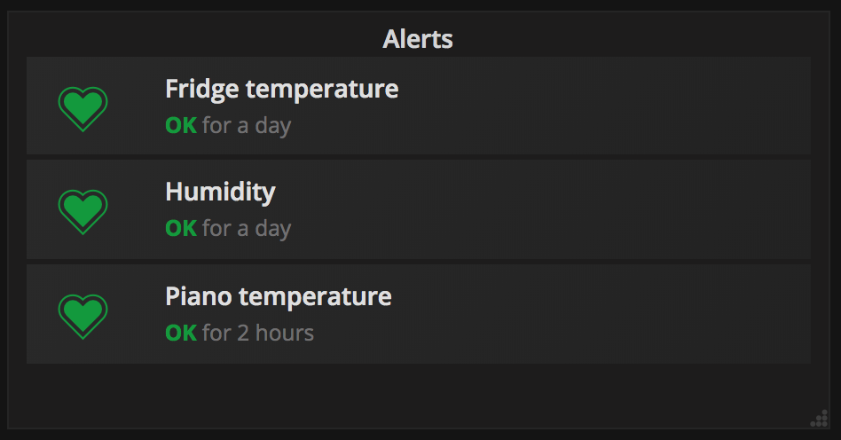

# Weather station

  
  

    
 <em>Figure 1: Hardware used for the home-made weather station: Raspberry Pi, Arduino Nano, a RXB6 433Mhz receiver,
 and as many GT-WT-01 temperature/humidity sensors as you like.</em>

    
 <em>Status board and alerts.</em>

    
 <em>Temperature of the fridge.</em>

    
 <em>Humdity in all rooms (the red line is the threshold; crossing it will raise an alert to slack).</em>

## Things you need

Hardware (see Figure 1):

* Raspberry Pi
* Arduino Nano
* [RF unit](https://www.amazon.de/gp/product/B06XHJMC82/ref=oh_aui_detailpage_o00_s00?ie=UTF8&psc=1) for the Arduino
 (don't try to safe a few dollars by getting the cheap one; it has a very limited range)
* [GT-WT-01 temperature/humidity sensors](https://www.ebay.com/itm/361435018543)
(get as many as you like; I bought six: one for outside, one for every room, one for the fridge, one inside my piano, etc.)

Software:
* [Prometheus](https://prometheus.io/)
* [Grafana](https://grafana.com/)
* [Flash Arduino to recieve signals](https://github.com/pimatic/homeduino#flashing)
* [Slack](https://slack.com/) (if you want to receive notifications or alerts)

## Dashboards

* `systemctl start grafana-server`

## Alerts

    
 <em>Alerts bla bla.</em>

* [Create Slack workspace](https://slack.com/intl/de-de/get-started) 

## Credits

* The idea and code of this [CO2 prometheus-exporter](https://github.com/larsp/co2monitor) written in go 
was the initial starting point for this project.  

* All that hard work of reverser engineering the protocols and finding the correct decodings has been
done [here](https://github.com/pimatic/rfcontroljs).
